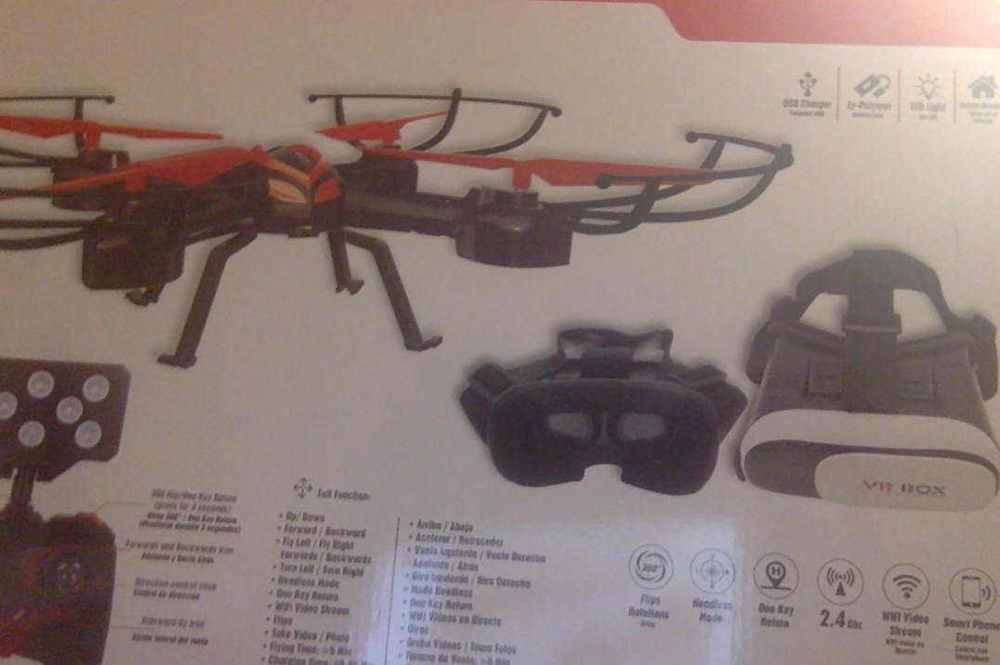
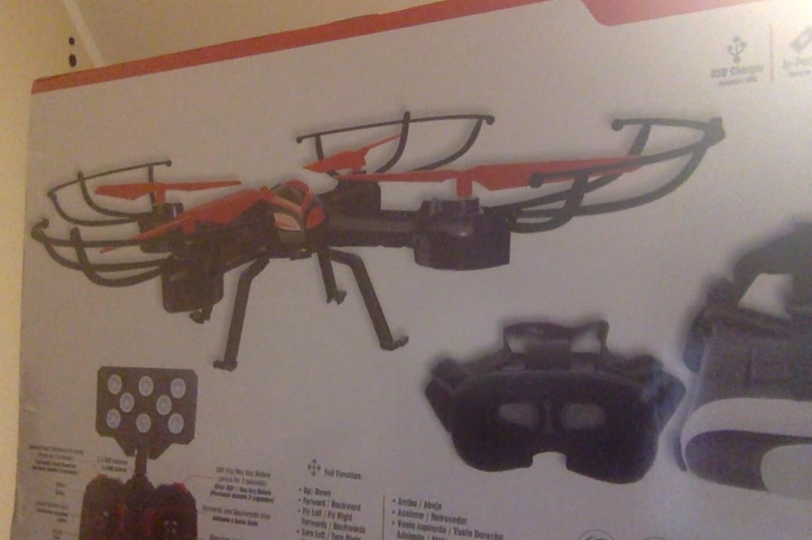
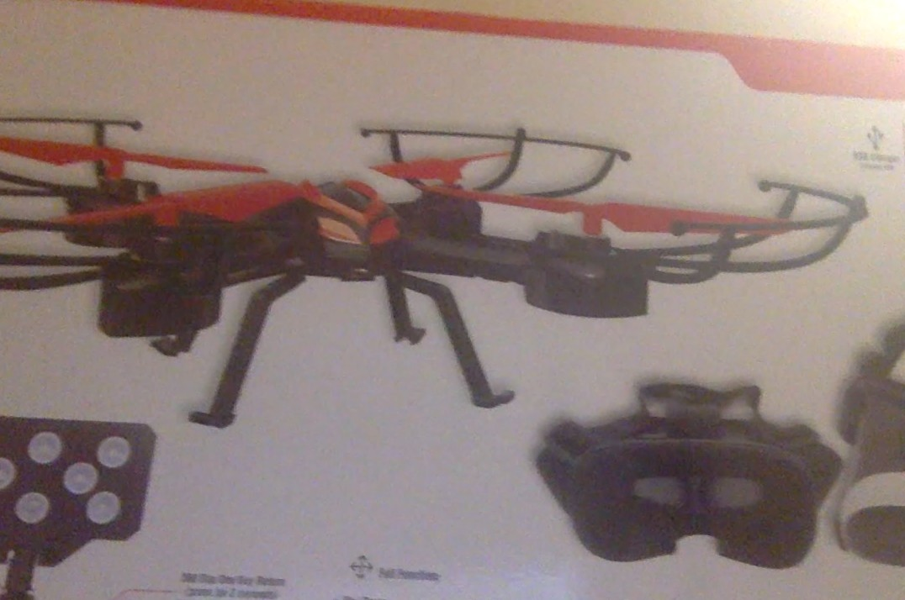
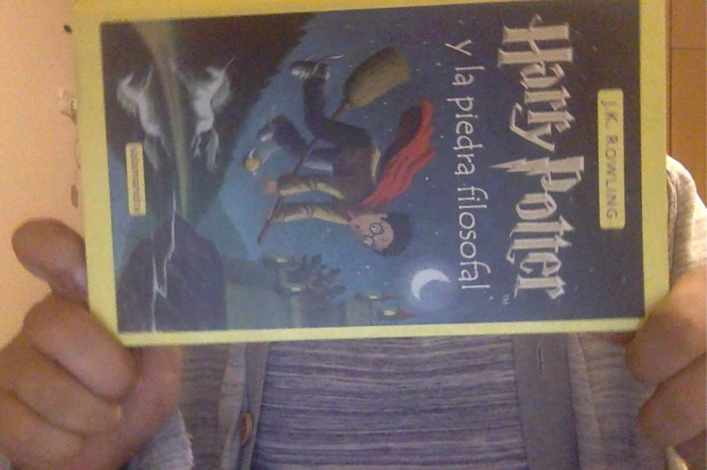
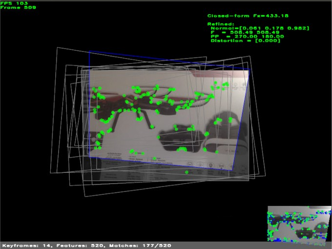
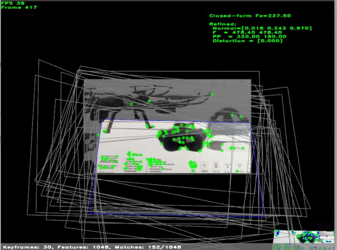
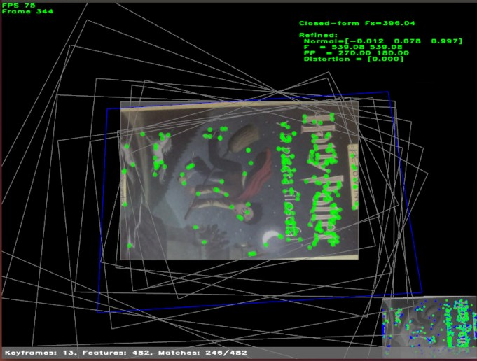

# A self calibration method using planar scenes
The following repository includes a self-calibrated method without using patterns (e.g. rings, circles, chessboard, etc). Since in the most environments you will find any planar scene.
## Installation
Tested on Ubuntu 14.04.
Clone the repository and inside the folder install the basic libraries:
```sh
sh prepare_linux_environment
```

Then create a folder (e.g. `build`)
```sh
mkdir build && cd build
```
And inside the folder run
```sh
cmake ..
```

Finally to compile, just run

```sh
make
```
## Running
To run the project go to `code/planecalib_desktop` folder. And execute the `planecalib_desktop`
```sh
cd code/planecalib_desktop
./planecalib_desktop
```

Without any parameter the program will use the default camera. If you need to pass a video, then run something like

```sh
./planecalib_desktop --VideoFile=myvideo.mp4
```
Where `myvideo.mp4` is the path to your video.

## Results
We tested the project, using two videos:

### Video 1 frames:




### Video 2 frames:




We got the following results for each video and camera.


|         |        |       FP       |       PP       |
|---------|--------|:--------------:|:--------------:|
| Video 1 | Webcam | 539.08; 539.08 |    270; 180    |
|         | Mobile | 483.72; 470.49 | 308.71; 170.63 |
| Video 2 | Webcam |  508,49;508.49 |    270; 180    |
|         | Mobile | 478.40; 478.40 |    320; 180    |

And the characteristic points for each video are:

### For video 1:




### For video 2:



